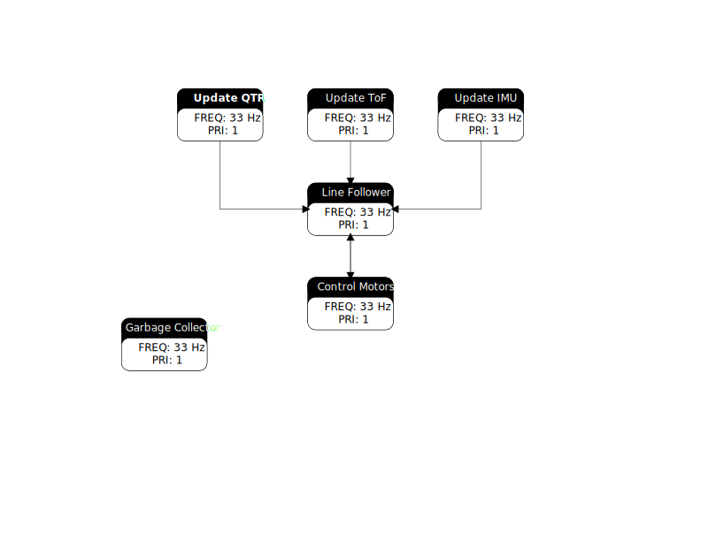

Code Structure
==============

This code uses a Finite State Machine (FSM) scheme for its structure.
It is implemented using the cotask and task_share modules provided from `<https://spluttflob.github.io/ME405-Support/index.html#ss_modules>`_

Task Diagram
************

To give an overview of this structure, here is a Task Diagram:

    Task Diagram

State Transition Diagrams
*************************

To give a little more detail into each task, here are State Transition Diagrams for each task labelled in the Task Diagram.

.. figure:: state_machines/Line_Follower.svg
    :alt: Line Follower Task

    Line Follower Task

    
    Motor Control Task

.. figure:: state_machines/Update_QTR.svg
    :alt: Update QTR Sensor Task

    Update QTR Sensor Task

.. figure:: state_machines/Update_IMU.svg
    :alt: Update IMU Task

    Update IMU Task

.. figure:: state_machines/Update_TOF.svg
    :alt: Update ToF Task

    Update ToF Task

.. figure:: state_machines/Garbage_Collector.svg
    :alt: Garbage Collector Task

    Garbage Collector Task

